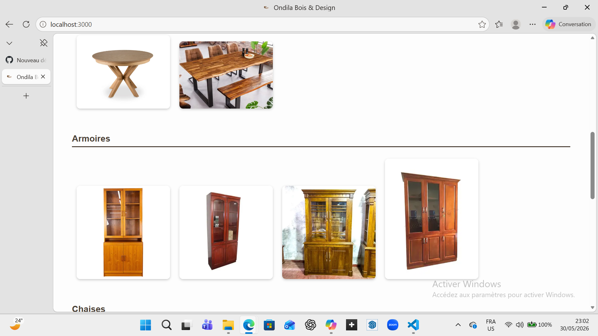

# Ondila Bois & Design

Site vitrine pour l’atelier **Ondila Bois & Design**, spécialisé dans la conception et la fabrication de meubles sur mesure.

---

## 🚀 Fonctionnalités
- Page d’accueil avec présentation de l’entreprise
- Portfolio dynamique avec galerie de meubles
- Formulaire de contact (Node.js + Nodemailer)
- Téléchargement d’extensions SketchUp
- Pages dédiées : Services, À propos, Contact

---

## 🖼️ Aperçu du site

---

## 🛠️ Technologies utilisées
- HTML / CSS / JavaScript
- Node.js (Express)
- Nodemailer (envoi d’emails)
- Hébergement sur Render

---

## 📞 Contact
- Email : contact@ondilaboisdesign.com  
- Téléphone : +237 6XX XX XX XX  

---

## 📜 Licence
Ce projet est distribué sous la **Licence MIT**.  
Vous êtes libre d’utiliser, copier, modifier et distribuer ce projet, à condition de conserver la mention du copyright :  

Copyright (c) 2026 Dilaneonanina 